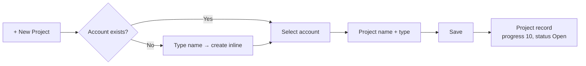
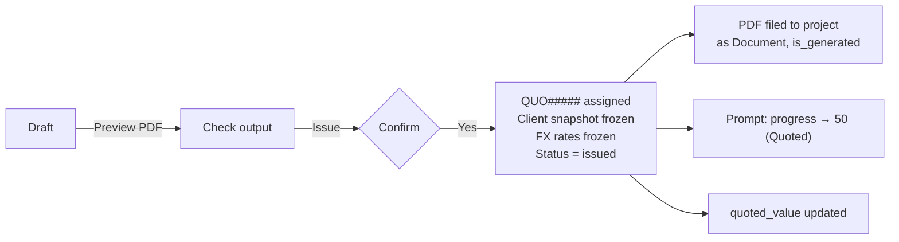
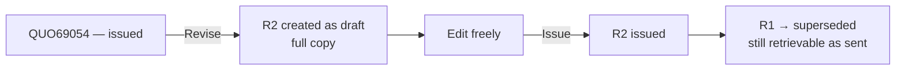
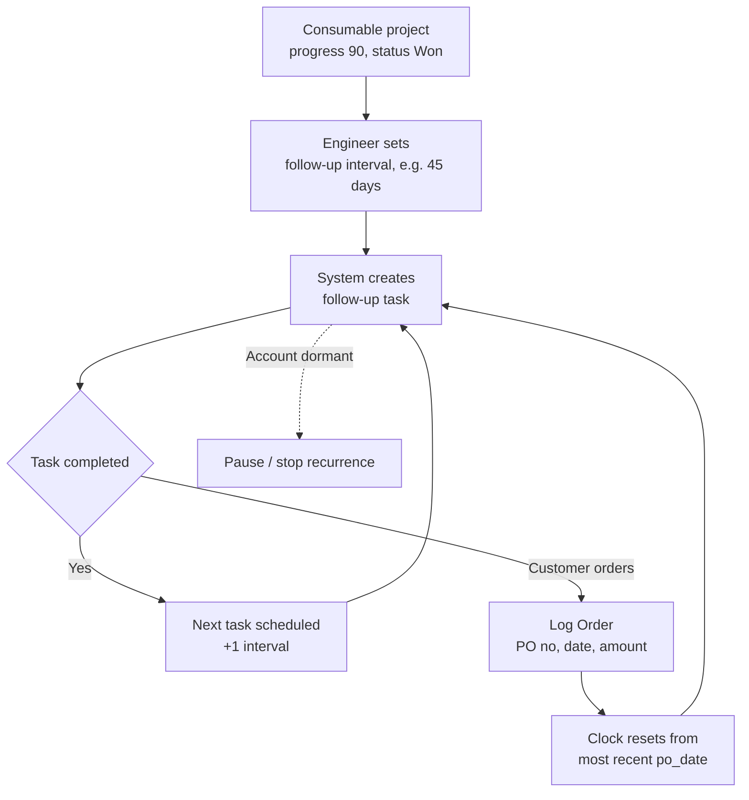

# VCS CRM — User Flows

| | |
|---|---|
| **Status** | Draft v1.1 — client Phase 1 spec; **Next.js confirmed** ([ADR-0042](decisions/0042-nextjs-stack-choices.md)) |
| **Last updated** | 2026-08-11 |
| **Reads from** | [Product concept](00-product-concept.md), [decision log](decisions/README.md) |
| **Feeds** | [`02-data-model.md`](02-data-model.md) |

> Terminology: **Project**, not Opportunity. Progress is a **percentage**; Status is **Open / Won / Lost** ([ADR-0028](decisions/0028-progress-and-status-are-independent.md)).

---

## 1. Design principles

Six rules, each with a reason. They are the tie-breakers for every screen decision below.

**1. Three fields to create anything.** Every create form has at most three required fields. The client's own story is explicit: *create a project from a phone call with only a company name and contact number.* A form that demands completeness gets abandoned, and the project stays in someone's inbox.

**2. Desktop composes, mobile captures.** **Confirmed: responsive web, desktop-first, mobile usable.** One codebase, no native app, no offline ([ADR-0038](decisions/0038-responsive-web-desktop-first.md)). Quotation building and reporting are desktop work — they need screen space and concentration. Logging a meeting after a client visit, ticking off a task, and checking what is due are phone work. The mobile paths are a real target, not a fallback: they must survive one hand, bright sun, and a poor connection.

**3. Never block on missing data.** An account that does not exist is created inline. An item not seen before is typed as free text ([ADR-0032](decisions/0032-product-master-deferred-to-phase-2.md)). Nothing stops a user mid-task to fix reference data.

**4. Margin is always visible internally, never printed.** Cost and margin appear live while building a quotation and are structurally absent from the PDF ([ADR-0031](decisions/0031-quotation-template-and-numbering.md)).

**5. Confirm only what is irreversible.** Issuing a quotation assigns a number and locks the document — that gets a confirmation. Saving a draft, changing progress, adding a line do not. Dialogs on reversible actions train people to click through the ones that matter.

**6. Every amount states its currency, and which of the three it is.** With multi-currency and three money figures ([ADR-0030](decisions/0030-order-record-per-po.md)), an unlabelled number is a defect.

## 2. Navigation

```
┌──────────────────────────────────────────────────────────────────┐
│  VCS CRM    My Tasks  Projects  Accounts  Reports        [Admin] │
│             [ 🔍 search ]                          [ + ]  [ 👤 ] │
└──────────────────────────────────────────────────────────────────┘
```

**Search** covers accounts, people, project names and numbers, quotation numbers, item codes, and document titles. Someone holding a printed `QUO69054` must be able to type it and land on the record.

**Quick create `+`** — Project · Quotation · Task · Meeting · Order · Document.

**Admin** (manager) — company settings, picklists (Incoterm, Unit, Country, DocumentType, TaskType, LeadSource, LostReason), note snippets, users. **Four hand-built screens** — a generic picklist editor covering all seven kinds, company settings, note snippets, users ([ADR-0042](decisions/0042-nextjs-stack-choices.md)).

## 3. Flow A — My Tasks (the landing page)

**Actor:** any user · **Device:** desktop, phone-usable · **Frequency:** daily

Tasks can exist without a project ([ADR-0027](decisions/0027-adopt-client-phase-1-specification.md)), so a project-by-project hunt would make them invisible. This is the daily landing page.

```
MY TASKS                                        Tue 11 August 2026

⚠  OVERDUE (3)
   Follow up reorder — Thai Poly Chem       🔁  4 days overdue   →
   Send TDS — Siam Kraft                        2 days overdue   →
   Renew import permit enquiry                  1 day overdue    →   (no project)

📅 DUE TODAY (2)
   Call K.Somchai re: AD4950 spec                                →
   Supplier request — DELO ACTIVIS pricing                       →

📆 THIS WEEK (5)                                            show →

💬 QUOTATIONS AWAITING CLIENT (4)
   QUO69054  Thai Poly Chem    ฿  248,000   issued 12d ago       →
   QUO69061  Bangkok Glass     ฿1,120,000   issued  4d ago       →

🔇 OPEN PROJECTS GONE QUIET (2)      no activity in 14+ days
   Thai Rayon — DUALBOND trial        60%  Open   ฿  310,000     →
```

**Rules that make this screen work**

- 🔁 marks an **auto-generated reorder follow-up** ([ADR-0029](decisions/0029-project-types-and-repeat-orders.md)) so it reads differently from a task someone chose to create.
- **Quotations awaiting client** lists `status = issued`, oldest first. Age is the point — it is what prompts action.
- **Gone quiet** covers `status = Open` projects only. **Won consumables are excluded** — they never close, so they would otherwise appear as neglected work forever ([ADR-0029](decisions/0029-project-types-and-repeat-orders.md)).
- Empty sections disappear. A screen of empty headings reads as broken.
- Tasks with no project still appear, labelled so.

## 4. Flow B — Create a project from a phone call

**Actor:** sales engineer · **Target:** under 60 seconds



**Required: account, project name, type.** Nothing else.

Silent defaults: `owner_user` = current user, `progress` = 10 (Lead received), `status` = Open, `currency` = account default or THB.

**Inline account creation takes a name only.** Types default to `[client]`; industry, address, and tax ID are added when someone needs them — which for a client is when the first quotation is issued, since tax ID and branch print on it.

**Contact is optional at creation.** The client's story says a company name and a contact number are enough, so a phone number can be captured as a person with just a name and number, or left for later.

## 5. Flow C — Build and export a quotation

**Actor:** sales engineer · **Device:** desktop · **Target:** under 10 minutes · **The centrepiece**

### C1. Starting

A quotation always belongs to a project ([ADR-0031](decisions/0031-quotation-template-and-numbering.md)). From `+ New Quotation`, the builder asks for an account and a short name and **creates the project inline** — the rule is enforced, the interruption is not.

Header defaults pull from the account: currency, payment term, bill-to name, address, tax ID and branch. **These are snapshotted onto the quotation at issue**, so editing the account later never changes what an issued document reprints as.

### C2. The builder

```
QUOTATION — DRAFT                     Project: Thai Poly Chem — AD4950 →

Client   Thai Poly Chem Co., Ltd.        Attention  K. Somchai P.
         0105566040011 (Head Office)     cc         K. Nid W.       [+]
Currency THB ▾   Date 11/08/2026   Validity [Until 30/9/2026    ]
Incoterm DDP ▾   Country of origin Germany ▾    VAT 7% ☑

LINE ITEMS                                    [ + line ]  [ 📋 snippet ]
──────────────────────────────────────────────────────────────────────────
1  1749560  DELO DUALBOND® AD4950 600 g            13 ea               ⋮
   ┌ cost  ฿  9,400  EUR? ▾ ┐  price ฿ 19,080   disc  −    ฿ 248,040
   └ margin 50.7% ▓▓▓▓▓▓▓░░ ┘
   [ + components ]  [ 📷 image ]

2  9520442  DELO-ACTIVIS 330 v1.1                   1 SET              ⋮
   ▸ 11 components                                  price ฿ 890,000
──────────────────────────────────────────────────────────────────────────
                                     Total          ฿1,138,040
                                     VAT 7%         ฿   79,663
                                     GRAND TOTAL    ฿1,217,703

        ┌──────────────────────────────────────────────────┐
        │  Cost ฿601,200 · Margin ฿536,840 · 47.2%         │  ← internal
        └──────────────────────────────────────────────────┘

TERMS   Lead time  [ 6-8 weeks after receipt of delivery… ] [ 📋 ]
        Payment    [ 30 days after the date of invoice     ]
        Remarks    [                                        ]

           [ Save draft ]  [ Preview PDF ]  [ Issue → ]
```

**Line entry with autocomplete.** Typing a code or name suggests from previously entered lines, ranked by recency then frequency, showing code and name together so near-duplicates are distinguishable. Selecting one fills code, name, unit, last unit price and last cost — as **editable defaults, never constraints** ([ADR-0032](decisions/0032-product-master-deferred-to-phase-2.md)). This is the only defence against typos in customer-facing product codes, so it has to be good.

**Components** — an optional un-priced sub-list per line (quantity + code + name), for kits like DELO-ACTIVIS 330. Collapsed by default; expanded shows all eleven.

**Per-line image** — optional upload, printed beside the component list.

**Cost currency and the FX rate are set once, on the quotation** — not per line ([ADR-0040](decisions/0040-fx-rate-at-quotation-level.md)). The builder shows both near the totals, so the engineer can see which rate produced the margin in front of them. **Issue is blocked if the currencies differ and no rate is set** — better a prompt than a silently null margin. All line costs on one quotation therefore share a currency (open question B11).

**Margin is live and internal.** Per line and per document, updating on every keystroke, never in the PDF (principle 4).

**Prices are net of VAT** ([ADR-0021](decisions/0021-quotation-tax-treatment.md)). The VAT checkbox turns off for export and zero-rated sales; the grand total is always on screen.

**Snippets** insert reusable text — the Hazardous Substances Control Bureau import-permission paragraph is written once, not retyped.

**Nobody types "See below".** If validity, delivery, or payment term is too long for the header bar, the system prints the value in the bar when it fits and "See below" automatically when it does not, rendering the full text into the terms block ([ADR-0031](decisions/0031-quotation-template-and-numbering.md)).

### C3. Issuing



Issuing is the one confirmation in the flow. It assigns the next `QUO#####`, snapshots the client block, freezes rates, locks the document, and **files the generated PDF back to the project as a Document automatically** — so the version sent is always retrievable.

The engineer then **downloads the PDF and emails it themselves**. No sending from the system in Phase 1.

Progress → 50 is **offered, not applied silently** — a revised quotation may be going out on a project already at 70.

### C4. Preview is not optional in practice

Because cost must never reach a customer and the layout is the riskiest component, **Preview PDF renders the real document through the real renderer** — not an HTML approximation. A preview that differs from the output is worse than none.

## 6. Flow D — Revise a quotation

Issued quotations cannot be edited.



Both PDFs stay on the project. Only the latest issued revision drives `quoted_value` and the forecast; superseded revisions are visible and never double-counted.

*Numbering of revisions is open — suffix recommended (B4).*

## 7. Flow E — The reorder loop

**Actor:** sales engineer · **The revenue-protecting flow** ([ADR-0029](decisions/0029-project-types-and-repeat-orders.md))



**Setting the interval is prompted, not buried.** When a consumable project is marked Won, the system asks for the follow-up interval on the spot — the one moment the engineer knows the customer's ordering rhythm.

**Logging an order is three fields plus a date**: PO number, amount, date, optional source quotation. Deliberately small, because this is the one Phase 1 entry that primarily serves reporting ([ADR-0001](decisions/0001-build-for-the-sales-engineer-first.md)) — but it also resets the follow-up clock, which is what the engineer actually wants, so the incentive aligns.

**Pause is a first-class action**, not deletion. A dormant account may wake up, and the history should survive.

## 8. Flow F — Moving and closing a project

Two independent controls, and the UI must not imply otherwise.

```
PROGRESS   ●───●───●───◐───○───○───○───○───○───○      60%
           10  20  30  40  50  60  70  80  90 100     Client reviewing

STATUS     ( ) Open      ( ) Won      ( ) Lost
```

**Progress** is a stepper — fixed 10% increments, always with the label beside the number, and **movable backwards** ([ADR-0028](decisions/0028-progress-and-status-are-independent.md)). Regression is normal and gets logged, not warned about.

**Status** is separate. Setting Lost **requires a reason** and **does not touch progress** — the frozen progress value *is* the lost-at-stage data.

Every change to either writes a `ProjectHistory` row: field, from, to, user, timestamp.

| Setting | Also asks for |
|---|---|
| **Won** — consumable | Follow-up interval (Flow E) |
| **Won** — equipment / part / service | Nothing. Order is logged separately |
| **Lost** | Reason (required) + free-text note; competitor if known |

*Whether status changes automatically at progress 90/100 is open (B7). Until answered, they are set independently and the UI shows both plainly.*

## 9. Flow G — Log a meeting across projects

**Actor:** any user · **Device:** phone-usable

A single client visit often covers several projects, so `Meeting → Project` is many-to-many, and a meeting may have **no project at all** — a relationship visit or introduction call ([ADR-0027](decisions/0027-adopt-client-phase-1-specification.md)).

```
Log meeting
  Account      Thai Poly Chem ▾
  Projects     [× AD4950 trial] [× ACTIVIS 330]  [+ add]   ← optional
  Date/time    11/08/2026  10:00      Duration  3.0 hours
  Mode         (•) Client site  ( ) Office  ( ) Online  ( ) Phone
  Attendees    Internal: [× Chayutpon]   External: [× K.Somchai] [+]
  Agenda       [                                        ]
  Outcome      [                                        ]
  Status       (•) Completed  ( ) Planned  ( ) Cancelled  ( ) No-show
```

**Expenses are captured here.** After saving, an optional `+ expense` step records category, amount, and a receipt photo against the meeting and its account ([ADR-0039](decisions/0039-minimal-expense-capture-reinstated.md)) — the one moment the receipt is still in the engineer's hand. Skippable, never mandatory: a required expense field on the app's most-used mobile path would be an obstacle.

```
  💰 Add expense?                                    [ skip ]
  Category  [Travel][Fuel][Hotel][Meals][Other]
  Amount    ฿ [   1,250        ]
  Receipt   [ 📷 Photograph ]
  ┌────────────────────────────────────────────┐
  │ 🔒 Only you and your manager can see this  │
  └────────────────────────────────────────────┘
```

The privacy notice is **on the screen, not in a policy**. The restriction exists so people record honestly, and that only works if they know about it while deciding what to enter ([ADR-0017](decisions/0017-expense-visibility-restriction.md)).

**Meeting hours are reported per account and per user, not per project.** A 3-hour visit covering two projects is not 6 hours of effort, and splitting it evenly invents precision that does not exist ([ADR-0027](decisions/0027-adopt-client-phase-1-specification.md), client A4). *Pending confirmation — N3.*

## 10. Flow H — File a document

From a project: drag files in, set type, issue date, version, status. Multiple at once, since documents arrive in batches.

Types (final list pending, N6): Quotation · Proposal · TDS · MOQ · PO · Service Report · Delivery Note · Invoice · Other.

**Quotations are never uploaded by hand** — they file themselves at issue with `is_generated = true` and a link back to the source quotation ([ADR-0031](decisions/0031-quotation-template-and-numbering.md)).

## 11. Flows I–K — sketched

**Also in Flow G's family:** expenses can be added directly from a project as well as from a meeting, for spend that belongs to a deal but not to a specific visit.

**I — Account 360.** Search → account → every project, person, meeting, task, document, and order in one view. The "I haven't spoken to them in a year" screen.

**J — Person view.** Every meeting and task involving one contact. Directly from the client's story.

**K — Reports.** Pipeline weighted by progress · win/loss **with lost-at-stage** · margin per project and line · activity volume and meeting hours per user · follow-up compliance · spare-part revenue traced to its parent equipment project. Fixed reports, filters plus CSV export ([ADR-0008](decisions/0008-fixed-reports-over-report-builder.md)).

## 12. What the flows revealed

Findings that came from walking screens, not from listing entities.

### 🟠 Fields the flows require, beyond the client's entity list

| Field | On | Why | Flow |
|---|---|---|---|
| `quoted_value` | Project | Derived from the latest issued quotation. Retained against the client spec — [ADR-0030](decisions/0030-order-record-per-po.md) quantifies the forecast error it prevents | C3 |
| `followup_paused` | Project | Pause is a distinct state from "no interval set" | E |
| `competitor` | Project | Asked at Lost; the most useful field in a loss report | F |
| `last_used_unit_price`, `last_used_unit_cost` | *(derived)* | What autocomplete pre-fills. A query over prior lines, not stored | C2 |
| `is_void` | Order | POs get cancelled. Void, do not delete | E |
| `cost_currency`, `fx_rate_cost_to_selling` | Quotation *(header)* | Margin is uncomputable without a rate. Header-level so it cannot be internally inconsistent ([ADR-0040](decisions/0040-fx-rate-at-quotation-level.md)) | C2 |

### 🟡 Open design questions

| # | Question | Where it bites |
|---|---|---|
| F1 | **Changing quotation currency after lines exist** — reprice or relabel? Repricing discards negotiated figures; relabelling silently changes meaning. *Suggest: warn, keep numbers, require confirmation* | C2 |
| F2 | **Can a manager edit an issued quotation?** Currently nobody can; the only path is a revision. Probably right, but it should be a decision | D |
| F3 | **Margin warning threshold** — should a low margin turn the bar amber? Needs a real number from VCS. *Suggest warn, never block* | C2 |
| F4 | **Two live quotations on one project** (option A / option B) — which drives `quoted_value`? *Suggest latest issued, with a "primary" override* | C3 |
| F5 | **A project whose only quotation is rejected** — auto-set status Lost, or leave Open for a re-quote? | D/F |
| F6 | **Deleting a line with components and an image** — cascade, or confirm? *Suggest confirm, cascade* | C2 |
| F7 | **Where do documents attach when a meeting spans projects?** Documents are project-scoped; a meeting is not | G/H |
| F8 | **Autocomplete across users** — does one engineer see items another typed? *Suggest yes; consistency is the point* | C2 |

## 13. Next

1. **Prototype the quotation PDF** before building any of these screens ([`03-tech-stack.md`](03-tech-stack.md) §3.3).
2. Answers to **B1** (a multi-line quotation sample) and **B7** (progress/status interaction) most directly change these flows.
3. Wireframe **Flow C** and **Flow E** properly — they carry the product.
4. F1–F8 can take the suggested defaults unless the client disagrees.

---

*Design decisions arising here are recorded in the [decision log](decisions/README.md).*
